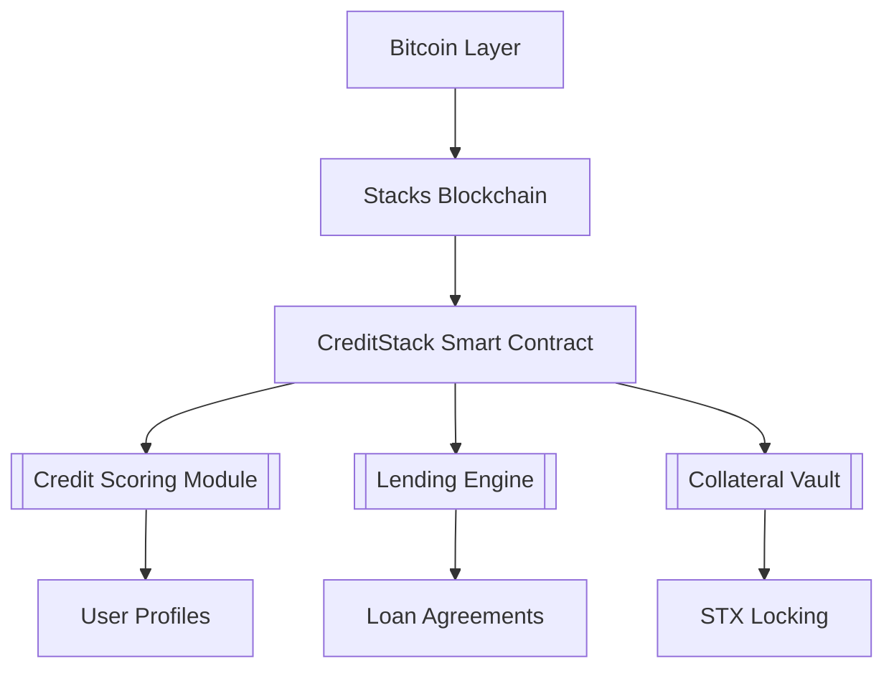
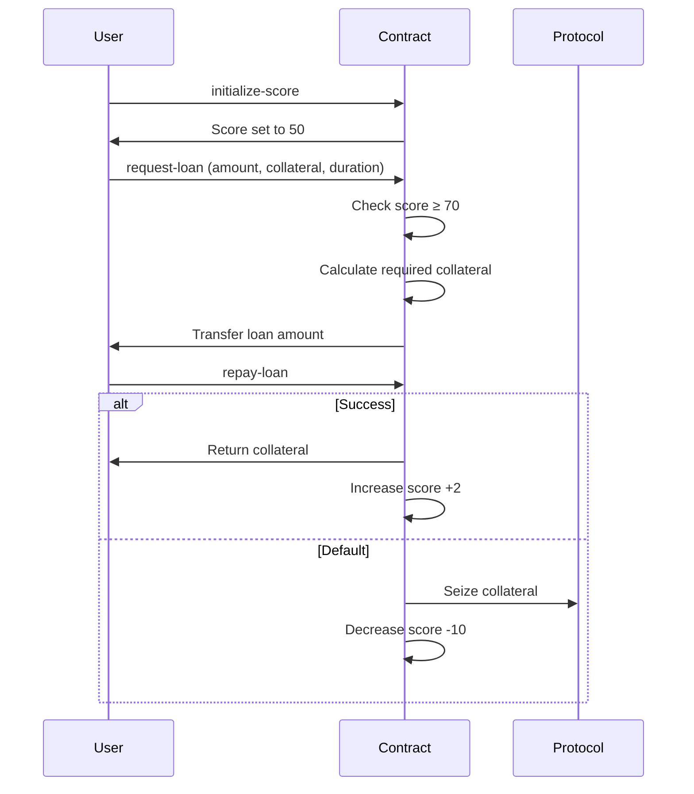

# 💳 CreditStack: Bitcoin-Native Credit Scoring & Lending Protocol

[](https://clarity-lang.org/)

**CreditStack** is a decentralized lending protocol on Stacks for Bitcoin DeFi. It enables **reputation-based lending** using **on-chain credit scoring**, offering dynamic interest rates and collateral requirements tied to user behavior.

## 🚀 Key Features

* 🛡️ **On-Chain Credit Scores**: Reputation built through verifiable repayment history.
* 💰 **Collateralized Lending**: Dynamic requirements (50–100%) based on credit score.
* 📈 **Performance-Based Interest**: Lower rates for creditworthy borrowers.
* 🏛️ **DAO Governance**: Risk parameters and upgrades managed by the community.
* 🔗 **Bitcoin DeFi Composability**: Portable credit profiles for broader ecosystem use.

---

## 🧠 System Architecture



### Core Modules

| Module               | Description                                                   |
| -------------------- | ------------------------------------------------------------- |
| **Credit Scoring**   | Score range 50–100, +2 for repayment, −10 for default         |
| **Lending Engine**   | Manages full loan lifecycle with rate/collateral calculations |
| **Collateral Vault** | Holds and manages locked STX; handles return or liquidation   |
| **Governance**       | Community-controlled risk parameters and loan configuration   |

---

## 🔁 Loan Workflow



---

## 🧑‍💻 Usage Examples

### Initialize Credit Profile

```clojure
(contract-call? .creditstack initialize-score)
```

### Request Loan

```clojure
(contract-call? .creditstack request-loan u1000 u800 u26280)
```

### Repay Loan

```clojure
(contract-call? .creditstack repay-loan u42 u500)
```

### Check Credit Score

```clojure
(contract-call? .creditstack get-user-score 'ST1PQHQKV0RJXZFY1DGX8MNSNYVE3VGZJSRTPGZGM)
```

### Mark Loan as Default (Admin)

```clojure
(contract-call? .creditstack mark-loan-defaulted u42)
```

---

## 📊 Read-Only Functions

* `get-user-score (principal)`
* `get-loan (loan-id)`
* `get-user-active-loans (principal)`

---

## 🔐 Security Model

* **Clarity-based Verification**: Secure by design; no runtime execution
* **Overcollateralization**: Enforces loan safety with dynamic ratios
* **Loan Limits**: Max 5 concurrent active loans per user
* **On-chain Enforcement**: Defaults penalized automatically via smart contract
* **Governance Controls**: Timelocked parameter upgrades

---

## 🛠 Development Setup

### Requirements

* [Clarinet](https://github.com/hirosystems/clarinet)
* Node.js v16+
* Bitcoin Testnet Node (optional for integration tests)

---

## 🧩 Governance

Governance is managed via a DAO, with voting rights over:

* Interest rates
* Minimum credit scores
* Collateral ratios
* Emergency upgrades

Example governance function:

```clojure
(define-public (update-min-score (new-score uint))
  (asserts! (is-eq tx-sender CONTRACT-OWNER) ERR-UNAUTHORIZED)
  (asserts! (and (>= new-score u50) (<= new-score u100)) ERR-INVALID)
  (ok (var-set MIN-LOAN-SCORE new-score))
)
```

---

## 🤝 Contributing

We welcome PRs! Please:

1. Fork the repo
2. Create a feature branch
3. Submit your PR with tests
